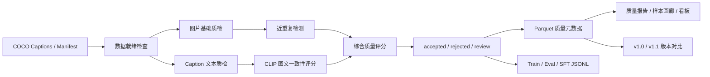

# 图文多模态训练数据处理与质量评估 Pipeline

[](https://github.com/Linyihhh1-Hub/multimodal-data-quality-pipeline/actions/workflows/tests.yml)

面向视觉语言模型（VLM）训练数据生产场景，本项目实现了一个离线图文多模态数据治理 Pipeline：从 COCO Captions 原始数据接入开始，完成图片/文本基础质检、CLIP 图文一致性评分、近重复检测、样本分层过滤、训练/评测/SFT JSONL 导出，以及质量报告、样本画廊和版本对比。

这个项目的重点不是训练大模型，也不是普通 OpenCV 图像识别，而是解决 **VLM 训练前的数据生产和质量治理问题**。

## 项目亮点

- 真实接入 COCO val2017，处理 5000 条图文 caption 样本。
- 支持规则质检和 HuggingFace CLIP 模型辅助评分两种模式。
- 构建 `accepted / rejected / review` 样本分层机制。
- 输出训练集、评测集、多轮对话 SFT JSONL。
- 记录 `filter_reason`、`final_quality_score`、`perceptual_hash`、`duplicate_group_size` 等质量元数据。
- 支持 v1.0/v1.1 规则迭代和版本质量对比。
- 生成 Markdown 质量报告、静态 HTML 样本画廊、Streamlit 看板和 caption 标签分布。

## 真实运行结果

本地已下载 COCO val2017，并在 5000 条 captions 上跑通完整流程。

| 指标 | 数值 |
| --- | ---: |
| COCO caption 样本数 | 5000 |
| Heuristic accepted | 4960 |
| Heuristic rejected | 40 |
| 近重复图片样本 | 3984 |
| CLIP v1.0 accepted | 4960 |
| CLIP v1.0 rejected | 40 |
| CLIP v1.1 accepted | 1283 |
| CLIP v1.1 review | 3677 |
| v1.0 -> v1.1 状态变化样本 | 3677 |

更多展示指标见：[docs/project_showcase.md](docs/project_showcase.md)

## 架构



## 核心能力

**数据接入**

- 支持 COCO Captions 标注解析。
- 支持统一 `manifest.jsonl` 输入。
- 提供 `dataset_doctor` 检查 manifest、图片缺失、空 caption、重复 ID。

**图片质量检测**

- 图片缺失/损坏检测
- 分辨率检测
- 宽高比异常检测
- 模糊度检测
- 亮度异常检测
- 感知哈希近重复检测

**文本质量检测**

- 空 caption 检测
- 过短/过长 caption 检测
- 非 printable 字符检测
- 敏感词扩展位

**模型辅助评分**

- 接入 HuggingFace CLIP。
- 使用 image/text embedding cosine similarity 计算图文一致性。
- 支持无模型环境下自动 fallback 到 deterministic heuristic scorer。

**数据集导出**

- 普通 caption JSONL
- eval JSONL
- 多轮对话 SFT JSONL
- review/rejected 样本队列

**质量分析**

- Markdown 质量报告
- 静态 HTML 样本画廊
- Streamlit 数据质量看板
- caption 高频标签分布
- v1.0/v1.1 数据版本对比

## 项目结构

```text
configs/
  quality_rules.yaml
  quality_rules_coco_clip_v1.1.yaml

scripts/
  download_coco_val2017.ps1
  prepare_coco_subset.py
  dataset_doctor.py
  generate_quality_report.py
  generate_sample_gallery.py
  analyze_caption_tags.py
  compare_versions.py

src/
  ingestion/
  quality/
  models/
  pipeline/
  storage/
  analysis/
  dashboard/

docs/
  project_showcase.md

examples/
  manifest_demo.jsonl
```

## 快速开始

安装基础依赖：

```powershell
pip install -r requirements.txt
```

生成 demo 数据并运行离线 Pipeline：

```powershell
python scripts/create_demo_data.py

python -m src.pipeline.run_pipeline `
  --manifest data/raw/manifest.jsonl `
  --raw-data-dir data/raw `
  --processed-dir data/processed `
  --export-dir data/exports `
  --version v1.0 `
  --no-clip
```

说明：`data/` 目录用于本地原始数据、处理结果和导出文件，不提交到 Git；仓库中只保留 `examples/manifest_demo.jsonl` 作为小型输入样例。

启动质量看板：

```powershell
streamlit run src/dashboard/app.py
```

## 跑真实 COCO 数据

下载并解压 COCO val2017：

```powershell
.\scripts\download_coco_val2017.ps1
```

构建 5000 条 COCO caption 子集：

```powershell
python scripts/prepare_coco_subset.py `
  --annotations data/raw/coco/annotations/captions_val2017.json `
  --source-image-dir data/raw/coco/val2017 `
  --output-raw-dir data/raw/coco_subset `
  --limit 5000
```

检查数据是否可进入 Pipeline：

```powershell
python scripts/dataset_doctor.py `
  --manifest data/raw/coco_subset/manifest.jsonl `
  --raw-data-dir data/raw/coco_subset `
  --output data/processed_coco/dataset_doctor_coco.json
```

运行基础规则版本：

```powershell
python -m src.pipeline.run_pipeline `
  --manifest data/raw/coco_subset/manifest.jsonl `
  --raw-data-dir data/raw/coco_subset `
  --processed-dir data/processed_coco `
  --export-dir data/exports_coco `
  --version coco_v1.0 `
  --no-clip
```

## 跑真实 CLIP 评分

安装 CLIP 依赖：

```powershell
pip install -r requirements-clip.txt
```

运行 COCO + CLIP v1.0：

```powershell
python -m src.pipeline.run_pipeline `
  --manifest data/raw/coco_subset/manifest.jsonl `
  --raw-data-dir data/raw/coco_subset `
  --processed-dir data/processed_clip_coco `
  --export-dir data/exports_clip_coco `
  --version coco_clip_v1.0 `
  --model-cache-dir data/models/huggingface `
  --clip-batch-size 32
```

运行更严格的 v1.1 规则：

```powershell
python -m src.pipeline.run_pipeline `
  --manifest data/raw/coco_subset/manifest.jsonl `
  --raw-data-dir data/raw/coco_subset `
  --processed-dir data/processed_clip_coco `
  --export-dir data/exports_clip_coco_v1.1 `
  --version coco_clip_v1.1 `
  --model-cache-dir data/models/huggingface `
  --clip-batch-size 32 `
  --quality-rules configs/quality_rules_coco_clip_v1.1.yaml
```

说明：模型缓存目录固定在 `data/models/huggingface`，避免 HuggingFace 默认用户目录权限问题。

## 生成分析报告

生成质量报告：

```powershell
python scripts/generate_quality_report.py `
  --metadata data/processed_clip_coco/processed_metadata_coco_clip_v1.1.parquet `
  --version coco_clip_v1.1 `
  --output data/processed_clip_coco/quality_report_coco_clip_v1.1.md
```

生成样本画廊：

```powershell
python scripts/generate_sample_gallery.py `
  --metadata data/processed_clip_coco/processed_metadata_coco_clip_v1.1.parquet `
  --output data/processed_clip_coco/sample_gallery_coco_clip_v1.1.html `
  --title "COCO CLIP V1.1 Quality Sample Gallery" `
  --limit 80
```

生成版本对比：

```powershell
python scripts/compare_versions.py `
  --old data/processed_clip_coco/processed_metadata_coco_clip_v1.0.parquet `
  --new data/processed_clip_coco/processed_metadata_coco_clip_v1.1.parquet `
  --output data/processed_clip_coco/version_compare_coco_clip_v1.0_v1.1.json
```

生成 caption 标签分布：

```powershell
python scripts/analyze_caption_tags.py `
  --metadata data/processed_coco/processed_metadata_coco_v1.0.parquet `
  --output data/processed_coco/tag_distribution_coco_v1.0.json `
  --top-k 30
```

## 输出样例

处理后的质量元数据包含：

```json
{
  "sample_id": "coco_123456",
  "image_path": "images/000000123456.jpg",
  "caption": "A person riding a bicycle on a city street.",
  "image_quality_score": 1.0,
  "text_quality_score": 1.0,
  "image_text_similarity": 0.6531,
  "final_quality_score": 0.8612,
  "filter_status": "accepted",
  "filter_reason": "",
  "perceptual_hash": "f0e1c3...",
  "duplicate_group_size": 5,
  "is_duplicate_image": true,
  "split": "train",
  "version": "coco_clip_v1.1"
}
```

训练集 JSONL：

```json
{"image":"images/000000123456.jpg","caption":"A person riding a bicycle on a city street."}
```

SFT JSONL：

```json
{
  "messages": [
    {"role": "user", "content": "<image>\nPlease describe this image."},
    {"role": "assistant", "content": "A person riding a bicycle on a city street."}
  ],
  "images": ["images/000000123456.jpg"]
}
```
