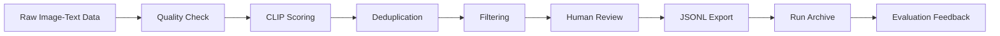
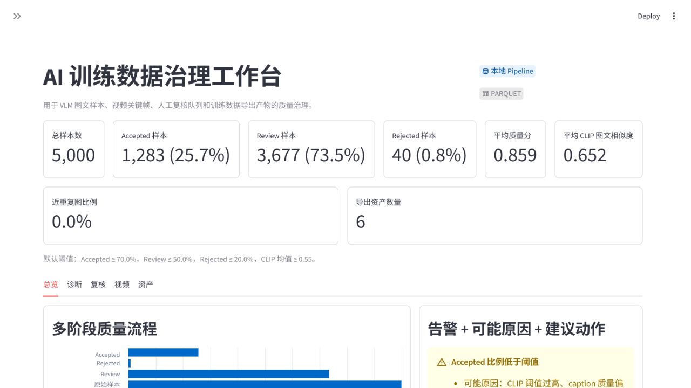
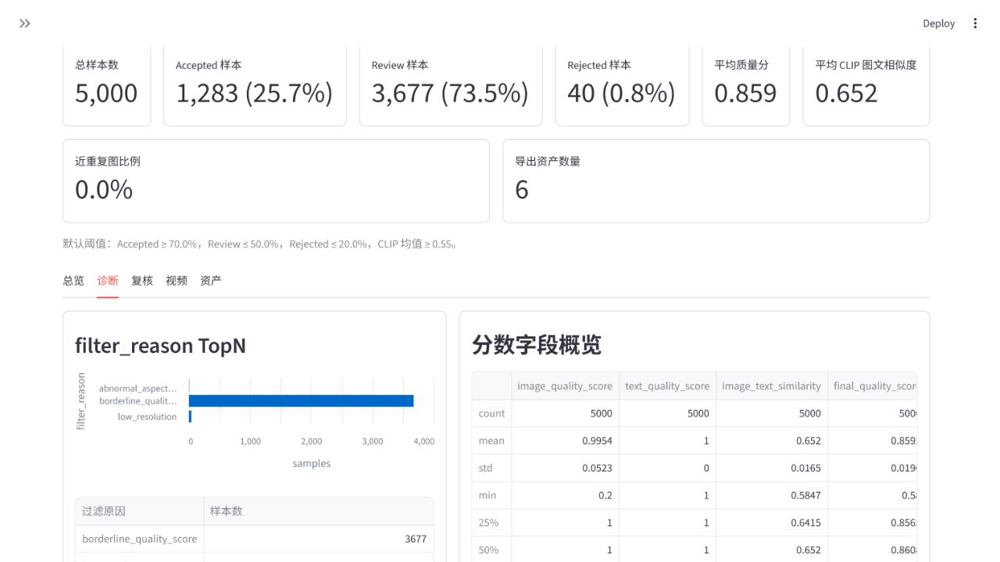
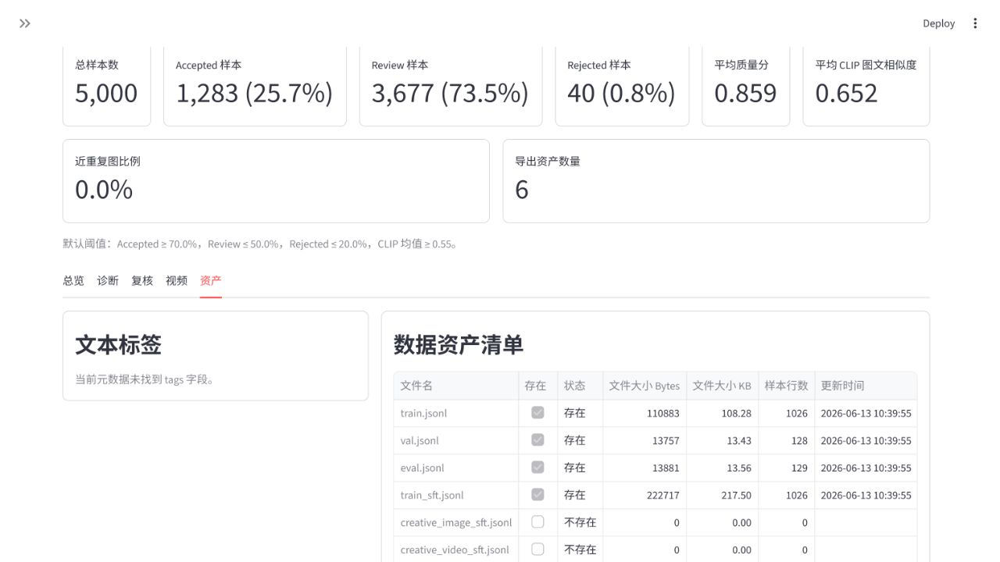

# AI 训练数据治理 Pipeline / 工作台

[](https://github.com/Linyihhh1-Hub/multimodal-data-quality-pipeline/actions/workflows/tests.yml)

面向视觉语言模型（VLM）训练数据生产场景，本项目实现了一条离线多模态数据治理 Pipeline。它从原始图文样本或 COCO Captions manifest 开始，完成基础质检、CLIP 图文一致性评分、近重复检测、样本分层过滤、人工复核回流、JSONL 导出、run 级别产物归档和模型评测错误样本回流。

这个项目不训练大模型，也不把重点放在单个视觉算法上。它关注的是训练前的数据工程问题：哪些样本可以进训练集，哪些样本需要复核，哪些质量问题需要被记录下来，下一轮数据清洗应该从哪里开始。

## 项目背景

在 VLM 训练数据生产中，原始图文样本通常不是“拿来就能训练”的状态：

1. 图片可能损坏，分辨率、亮度、模糊度或宽高比不符合要求。
2. Caption 可能为空、过短、过长，或者包含不可打印字符。
3. 图文语义可能不一致，低质量 caption 会混入训练集。
4. 重复和近重复图片会造成训练数据冗余，也可能放大数据偏差。
5. `accepted / rejected / review` 的判定如果只停留在脚本输出里，很难复盘。
6. 人工复核结果、训练导出文件、质量报告和评测错误样本往往分散在不同目录里。
7. 微调或评测之后只看总分，无法判断错误来自模型能力、数据质量，还是训练覆盖不足。

本项目把这些问题拆成一条可运行的治理链路。每一步都产出结构化元数据，方便后续报告、看板、复核和二轮迭代。

## 项目目标

构建一个可复现、可追溯、可扩展的多模态训练数据治理 Pipeline：

- 可复现：同一份 manifest、规则配置和模型开关可以重复运行。
- 可追溯：每条样本保留质量分、过滤原因、split、版本和重复信息。
- 可扩展：规则质检、CLIP 评分、人工复核、run 归档和评测错误回流彼此解耦，便于替换或扩展。

## 核心流程



对应到当前代码：

- `src.pipeline.run_pipeline`：主 Pipeline，完成图文质检、评分、分层和导出。
- `src.review.apply_review_feedback`：人工复核结果回流。
- `src.utils.run_manager`：run 级别产物归档。
- `src.evaluation.evaluation_feedback`：模型评测错误样本回流。
- `src.dashboard.app`：Streamlit 治理工作台。

## 核心功能

### 图片 / 文本质检

图片质检位于 `src/quality/image_quality.py`，检查图片是否存在、是否可读、分辨率、宽高比、模糊度和亮度。文本质检位于 `src/quality/text_quality.py`，检查空 caption、长度和不可打印字符。

质检结果会写入元数据字段，例如：

- `image_valid`
- `image_filter_status`
- `image_filter_reasons`
- `text_valid`
- `text_filter_status`
- `text_filter_reasons`

### CLIP 图文一致性评分

`src/models/clip_scorer.py` 支持 HuggingFace CLIP，也支持无模型环境下的 deterministic heuristic scorer。主 Pipeline 会把分数写入：

- `image_text_similarity`
- `final_quality_score`

如果不想加载 CLIP，可使用 `--no-clip`。

### 近重复检测

`src/quality/duplicate_detector.py` 使用感知哈希记录近重复信息。输出字段包括：

- `perceptual_hash`
- `duplicate_group_size`
- `is_duplicate_image`

这些字段也会用于 train/eval 泄漏检测。

### 样本分层过滤

`src/quality/quality_scorer.py` 将图片质量、文本质量和图文一致性合成为最终状态：

- `accepted`：可进入训练或评测导出。
- `review`：边界样本，建议人工复核。
- `rejected`：质量不达标，保留原因但不进入训练集。

主要输出字段：

- `filter_status`
- `filter_reason`
- `split`
- `version`

### 人工复核回流

自动规则适合做初筛，但 `review` 样本仍需要人工判断。项目通过 `review_samples.jsonl` 保存待复核样本，再用 `examples/review_decisions_demo.jsonl` 这样的决策文件回流为新版本元数据。

```powershell
python -m src.review.apply_review_feedback `
  --metadata data/processed/processed_metadata_v1.0.parquet `
  --feedback examples/review_decisions_demo.jsonl `
  --output data/processed/processed_metadata_v1.2_reviewed.parquet `
  --version v1.2
```

回流后会保留：

- `review_decision`
- `reviewer`
- `review_reason`
- `review_time`
- `status_before_review`
- `status_after_review`
- `review_applied`

### JSONL 导出

主 Pipeline 会导出训练、评测和 SFT 文件：

- `train.jsonl`
- `val.jsonl`
- `eval.jsonl`
- `train_sft.jsonl`
- `review_samples.jsonl`
- `rejected_samples.jsonl`

另有 `src.pipeline.export_creative_sft` 支持智能创作 SFT 数据导出，配置入口见 `python -m src.cli creative-sft --config configs/pipeline.yaml`。

### Run 级别产物归档

每次运行主 Pipeline 时，默认会在 `outputs/runs/<run_id>/` 下保存本次运行的归档产物。原有 `data/processed` 和 `data/exports` 输出不变。

每个 run 目录包含：

- `config_snapshot.yaml`
- `manifest.json`
- `quality_report.json`
- `filtered_samples.jsonl`
- `run_summary.md`

可以显式指定 run id：

```powershell
python -m src.pipeline.run_pipeline `
  --manifest data/raw/manifest.jsonl `
  --raw-data-dir data/raw `
  --processed-dir data/processed `
  --export-dir data/exports `
  --version v1.0 `
  --no-clip `
  --run-id demo-v1 `
  --runs-dir outputs/runs
```

如需关闭归档，可添加 `--no-run-archive`，或在 `configs/pipeline.yaml` 中设置：

```yaml
runs:
  archive: false
```

### 模型评测错误样本回流

`src.evaluation.evaluation_feedback` 用于把下游模型评测错误样本回流到数据治理环节。它不接入真实模型训练，也不依赖 OpenCompass；当前实现重点是模拟“模型评测结果 -> 数据诊断 -> 二轮筛选清单”的闭环。

输入支持 CSV 或 JSONL，至少包含：

- `sample_id`
- `prediction`
- `ground_truth`
- `error_type`
- `error_reason`

运行示例：

```powershell
python -m src.evaluation.evaluation_feedback `
  --errors examples/evaluation_errors.csv `
  --metadata data/processed/processed_metadata_v1.0.parquet `
  --output-dir data/processed/evaluation_feedback
```

输出：

- `evaluation_feedback_report.md`
- `second_round_manifest.jsonl`

`second_round_manifest.jsonl` 中的建议包括：

- `keep`
- `remove`
- `review`
- `augment_candidate`

## 输出产物说明

### 质量元数据

主元数据默认写入：

```text
data/processed/processed_metadata_<version>.parquet
```

典型字段：

```json
{
  "sample_id": "demo_demo_1",
  "image_path": "images/demo_1.jpg",
  "caption": "A person rides a bicycle on a city street.",
  "image_quality_score": 1.0,
  "text_quality_score": 1.0,
  "image_text_similarity": 0.8292,
  "final_quality_score": 0.9317,
  "filter_status": "accepted",
  "filter_reason": "",
  "perceptual_hash": "d7cb6930619296cb",
  "duplicate_group_size": 2,
  "is_duplicate_image": false,
  "split": "eval",
  "version": "v1.0"
}
```

### 训练 / 评测 / SFT JSONL

默认写入：

```text
data/exports/
```

普通训练 JSONL：

```json
{"image":"images/demo_1.jpg","caption":"A person rides a bicycle on a city street."}
```

SFT JSONL：

```json
{
  "messages": [
    {"role": "user", "content": "<image>\nPlease describe this image."},
    {"role": "assistant", "content": "A person rides a bicycle on a city street."}
  ],
  "images": ["images/demo_1.jpg"]
}
```

### 报告、看板和分析产物

当前项目支持这些分析入口：

```powershell
python -m src.cli report --config configs/pipeline.yaml
python scripts/generate_quality_report.py --metadata data/processed/processed_metadata_v1.0.parquet --version v1.0 --output data/processed/quality_report.md
python scripts/generate_sample_gallery.py --metadata data/processed/processed_metadata_v1.0.parquet --output data/processed/sample_gallery.html --title "Sample Gallery" --limit 80
python scripts/analyze_caption_tags.py --metadata data/processed/processed_metadata_v1.0.parquet --output data/processed/tag_distribution.json --top-k 30
```

DuckDB 聚合：

```powershell
python -m src.distributed.duckdb_quality_agg `
  --input data/processed/processed_metadata_v1.0.parquet `
  --output data/processed/quality_summary.json
```

Train/Eval 泄漏检测：

```powershell
python -m src.quality.split_leakage `
  --metadata data/processed/processed_metadata_v1.0.parquet `
  --output data/processed/split_leakage_report.json
```

Streamlit 工作台：

```powershell
.\scripts\run_dashboard.ps1
```

工作台包含：

- `总览`：样本通过率、复核率、拒绝率、平均质量分、CLIP 均值和治理漏斗。
- `诊断`：过滤原因 TopN、质量分/相似度/caption 长度分布和低质量样本。
- `复核`：review 样本队列。
- `视频`：视频级和帧级 manifest。
- `资产`：导出 JSONL、SFT 数据和标签分布。
- `Run Center`：读取 `outputs/runs/`，展示历史 run。
- `Feedback Loop`：读取评测错误回流产物，展示错误类型和二轮建议。

## 快速开始

安装基础依赖：

```powershell
python -m venv .venv
.\.venv\Scripts\Activate.ps1
python -m pip install -r requirements.txt
```

生成 demo 数据：

```powershell
python scripts/create_demo_data.py
```

运行离线 Pipeline：

```powershell
python -m src.pipeline.run_pipeline `
  --manifest data/raw/manifest.jsonl `
  --raw-data-dir data/raw `
  --processed-dir data/processed `
  --export-dir data/exports `
  --version v1.0 `
  --no-clip
```

使用配置驱动 CLI：

```powershell
python -m src.cli doctor --config configs/pipeline.yaml
python -m src.cli run --config configs/pipeline.yaml
python -m src.cli report --config configs/pipeline.yaml
python -m src.cli video --config configs/pipeline.yaml
python -m src.cli creative-sft --config configs/pipeline.yaml
```

启动工作台：

```powershell
.\scripts\run_dashboard.ps1
```

说明：`data/`、`outputs/`、`.tmp/` 用于本地生成产物，不提交到 Git。

## 示例数据

仓库提供小型样例输入：

- `examples/manifest_demo.jsonl`：图文 manifest 示例。
- `examples/review_decisions_demo.jsonl`：人工复核决策示例。
- `examples/evaluation_errors.csv`：模型评测错误样本示例。

也可以生成本地 demo 数据：

```powershell
python scripts/create_demo_data.py
```

视频处理示例：

```powershell
python scripts/create_demo_video.py

python scripts/process_video_demo.py `
  --video data/raw/videos/demo_video.mp4 `
  --frame-output-dir data/raw/video_frames/demo_video `
  --raw-data-dir data/raw `
  --video-manifest data/processed/video_manifest.jsonl `
  --manifest data/processed/video_frame_manifest.jsonl `
  --interval 1.0 `
  --max-frames 16
```

COCO 子集流程：

```powershell
.\scripts\download_coco_val2017.ps1

python scripts/prepare_coco_subset.py `
  --annotations data/raw/coco/annotations/captions_val2017.json `
  --source-image-dir data/raw/coco/val2017 `
  --output-raw-dir data/raw/coco_subset `
  --limit 5000

python scripts/dataset_doctor.py `
  --manifest data/raw/coco_subset/manifest.jsonl `
  --raw-data-dir data/raw/coco_subset `
  --output data/processed_coco/dataset_doctor_coco.json
```

运行 COCO 基础规则版：

```powershell
python -m src.pipeline.run_pipeline `
  --manifest data/raw/coco_subset/manifest.jsonl `
  --raw-data-dir data/raw/coco_subset `
  --processed-dir data/processed_coco `
  --export-dir data/exports_coco `
  --version coco_v1.0 `
  --no-clip
```

运行 COCO + CLIP：

```powershell
pip install -r requirements-clip.txt

python -m src.pipeline.run_pipeline `
  --manifest data/raw/coco_subset/manifest.jsonl `
  --raw-data-dir data/raw/coco_subset `
  --processed-dir data/processed_clip_coco `
  --export-dir data/exports_clip_coco `
  --version coco_clip_v1.0 `
  --model-cache-dir data/models/huggingface `
  --clip-batch-size 32
```

## 测试方式

运行全量测试：

```powershell
.\.venv\Scripts\python.exe -m pytest
```

按模块运行：

```powershell
.\.venv\Scripts\python.exe -m pytest tests/test_pipeline.py
.\.venv\Scripts\python.exe -m pytest tests/test_run_manager.py
.\.venv\Scripts\python.exe -m pytest tests/test_evaluation_feedback.py
.\.venv\Scripts\python.exe -m pytest tests/test_dashboard_metrics.py
```

## 项目结构

```text
configs/
  pipeline.yaml
  quality_rules.yaml
  quality_rules_coco_clip_v1.1.yaml

examples/
  manifest_demo.jsonl
  review_decisions_demo.jsonl
  evaluation_errors.csv

scripts/
  create_demo_data.py
  create_demo_video.py
  dataset_doctor.py
  download_coco_val2017.ps1
  prepare_coco_subset.py
  process_video_demo.py
  generate_quality_report.py
  generate_sample_gallery.py
  analyze_caption_tags.py
  compare_versions.py
  run_dashboard.ps1

src/
  ingestion/
  quality/
  models/
  pipeline/
  review/
  evaluation/
  utils/
  storage/
  analysis/
  dashboard/
  distributed/
  video/

tests/
  test_pipeline.py
  test_run_manager.py
  test_evaluation_feedback.py
  test_dashboard_metrics.py
  ...
```

## 本地运行记录

本地曾在 COCO val2017 子集上跑通过完整流程，保留的展示指标如下：

| 指标 | 数值 |
| --- | ---: |
| COCO caption 样本数 | 5000 |
| Heuristic accepted | 4960 |
| Heuristic rejected | 40 |
| 近重复图片样本 | 3984 |
| CLIP v1.0 accepted | 4960 |
| CLIP v1.0 rejected | 40 |
| CLIP v1.1 accepted | 1283 |
| CLIP v1.1 review | 3677 |
| v1.0 -> v1.1 状态变化样本 | 3677 |

更多展示指标见：[docs/project_showcase.md](docs/project_showcase.md)。

## 看板预览

### 总览



### 诊断



### 数据资产


