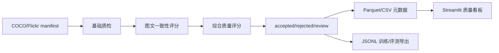

# 图文多模态训练数据处理与质量评估 Pipeline

面向视觉语言模型后训练数据生产场景，本项目把原始图文样本加工成可用于训练、微调和评测的数据集，并沉淀自动质检、模型辅助评分、样本分层导出和质量看板。

第一版 MVP 聚焦图文数据，不做完整视频链路，不强依赖在线大模型生成 caption。CLIP 相似度模块支持可选启用；离线环境下会自动使用确定性启发式 scorer，保证 Pipeline 可以本地跑通。

## 架构



## 核心能力

- 数据接入：读取统一 manifest 或 COCO captions 标注，生成 `sample_id/image_path/caption/source`。
- 图片质检：图片缺失、损坏、分辨率、宽高比、模糊度、亮度、文件大小。
- 文本质检：caption 空值、过短、过长、不可打印字符、敏感词扩展位。
- 图文一致性：可选 CLIP；无模型环境自动降级到 deterministic heuristic scorer。
- 综合评分：`0.35 * image_quality + 0.25 * text_quality + 0.40 * image_text_similarity`。
- 数据导出：`train.jsonl`、`val.jsonl`、`eval.jsonl`、`train_sft.jsonl`、`review_samples.jsonl`、`rejected_samples.jsonl`。
- 质量看板：样本通过率、过滤原因、评分分布和待复核样本表。

## Manifest 格式

`data/raw/manifest.jsonl` 每行一个样本：

```json
{"image_id":"000000391895","image_path":"images/000000391895.jpg","caption":"A man riding a bike down a street.","source":"coco"}
```

图片路径可以是绝对路径，也可以是相对 `data/raw` 的路径。

## 本地运行

安装依赖：

```powershell
pip install -r requirements.txt
```

生成本地 demo 数据：

```powershell
python scripts/create_demo_data.py
```

运行离线 MVP：

```powershell
.\scripts\run_local_pipeline.ps1 -Manifest data/raw/manifest.jsonl -RawDataDir data/raw -Version v1.0
```

启用 CLIP：

```powershell
pip install -r requirements-clip.txt
.\scripts\run_local_pipeline.ps1 -Manifest data/raw/manifest.jsonl -RawDataDir data/raw -Version v1.0 -UseClip
```

启动看板：

```powershell
streamlit run src/dashboard/app.py
```

## 输出

```text
data/processed/processed_metadata_v1.0.parquet
data/exports/train.jsonl
data/exports/val.jsonl
data/exports/eval.jsonl
data/exports/train_sft.jsonl
data/exports/review_samples.jsonl
data/exports/rejected_samples.jsonl
```

如果本地没有 Parquet engine，元数据会自动降级输出为 CSV，保证 Pipeline 不被环境阻塞。

## 简历描述

图文多模态训练数据处理与质量评估 Pipeline：构建面向视觉语言模型训练数据生产的离线数据 Pipeline，完成图文样本接入、图片/文本基础质检、图文一致性评估、综合质量评分、accepted/rejected/review 样本分层、训练/评测 JSONL 导出与 Streamlit 质量看板建设。通过过滤原因、质量分和版本字段沉淀数据治理元数据，支持后续规则迭代和数据闭环分析。
