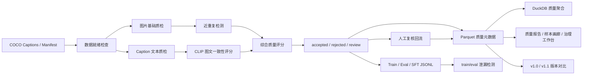

# AI 训练数据治理 Pipeline / 工作台

[](https://github.com/Linyihhh1-Hub/multimodal-data-quality-pipeline/actions/workflows/tests.yml)

面向视觉语言模型（VLM）训练数据生产场景，本项目实现了一个离线图文多模态数据治理 Pipeline：从 COCO Captions 原始数据接入开始，完成图片/文本基础质检、CLIP 图文一致性评分、近重复检测、样本分层过滤、人工复核回流、训练/评测/SFT JSONL 导出、train/eval 泄漏检测，以及质量报告、样本画廊、DuckDB 聚合分析和 Streamlit 治理工作台。

这个项目的重点不是训练大模型，也不是普通 OpenCV 图像识别，而是解决 **VLM 训练前的数据生产和质量治理问题**。

## 项目亮点

- 真实接入 COCO val2017，处理 5000 条图文 caption 样本。
- 支持规则质检和 HuggingFace CLIP 模型辅助评分两种模式。
- 构建 `accepted / rejected / review` 样本分层机制。
- 输出训练集、评测集、多轮对话 SFT JSONL。
- 记录 `filter_reason`、`final_quality_score`、`perceptual_hash`、`duplicate_group_size` 等质量元数据。
- 提供 DuckDB 质量元数据聚合脚本，用于大规模 Parquet 质量统计和看板供数。
- 支持人工复核决策文件回流，生成可追踪的新版本质量元数据。
- 提供 train/eval 泄漏检测，检查 `sample_id`、`image_id`、`image_path`、`perceptual_hash`、`duplicate_group_id` 跨 split 重复风险。
- 扩展视频数据处理模块，支持视频元信息解析、关键帧采样、帧级质量检测和视频/帧级 manifest 构建。
- 支持 v1.0/v1.1 规则迭代和版本质量对比。
- 生成 Markdown 质量报告、静态 HTML 样本画廊、AI 训练数据治理工作台和 caption 标签分布。

## 真实运行结果

本地已下载 COCO val2017，并在 5000 条 captions 上跑通完整流程。

| 指标 | 数值 |
| --- | ---: |
| COCO caption 样本数 | 5000 |
| Heuristic accepted | 4960 |
| Heuristic rejected | 40 |
| 近重复图片样本 | 3984 |
| CLIP v1.0 accepted | 4960 |
| CLIP v1.0 rejected | 40 |
| CLIP v1.1 accepted | 1283 |
| CLIP v1.1 review | 3677 |
| v1.0 -> v1.1 状态变化样本 | 3677 |

更多展示指标见：[docs/project_showcase.md](docs/project_showcase.md)

## 架构



## 核心能力

**数据接入**

- 支持 COCO Captions 标注解析。
- 支持统一 `manifest.jsonl` 输入。
- 提供 `dataset_doctor` 检查 manifest、图片缺失、空 caption、重复 ID。

**图片质量检测**

- 图片缺失/损坏检测
- 分辨率检测
- 宽高比异常检测
- 模糊度检测
- 亮度异常检测
- 感知哈希近重复检测

**文本质量检测**

- 空 caption 检测
- 过短/过长 caption 检测
- 非 printable 字符检测
- 敏感词扩展位

**模型辅助评分**

- 接入 HuggingFace CLIP。
- 使用 image/text embedding cosine similarity 计算图文一致性。
- 支持无模型环境下自动 fallback 到 deterministic heuristic scorer。

**数据集导出**

- 普通 caption JSONL
- eval JSONL
- 多轮对话 SFT JSONL
- 智能创作 SFT JSONL
- review/rejected 样本队列

**质量分析**

- Markdown 质量报告
- 静态 HTML 样本画廊
- Streamlit AI 训练数据治理工作台，包含总览、诊断、复核、视频、资产多个中文视图
- caption 高频标签分布
- v1.0/v1.1 数据版本对比
- DuckDB 聚合质量元数据，输出状态比例、过滤原因 TopN、CLIP 分布、重复率、source/split 分布等指标

**数据治理闭环**

- 自动规则和 CLIP 分数完成大规模初筛。
- `review` 样本进入人工复核队列，不直接进入训练集。
- 人工复核结果通过 JSONL 决策文件回流为新版本数据。
- 导出后检查 train/eval 之间的同样本、同图、同路径和近重复泄漏风险，避免评测集污染。

**视频数据处理**

- 使用 OpenCV 解析视频时长、FPS、帧数、分辨率和文件大小。
- 支持固定时间间隔抽帧，并可限制单视频最大采样帧数。
- 复用图片质量规则检测关键帧分辨率、亮度、模糊度等指标。
- 输出视频级 `video_manifest.jsonl` 和帧级 `video_frame_manifest.jsonl`。
- 汇总 `valid_frame_count`、`rejected_frame_count`、`video_quality_score` 等视频级质量指标。

## 项目结构

```text
configs/
  quality_rules.yaml
  quality_rules_coco_clip_v1.1.yaml

scripts/
  download_coco_val2017.ps1
  run_dashboard.ps1
  prepare_coco_subset.py
  create_demo_video.py
  process_video_demo.py
  dataset_doctor.py
  generate_quality_report.py
  generate_sample_gallery.py
  analyze_caption_tags.py
  compare_versions.py

src/
  ingestion/
  quality/
    split_leakage.py
  models/
  video/
  pipeline/
  storage/
  analysis/
  dashboard/
  distributed/
  review/

docs/
  project_showcase.md
  data_card.md
  scaling_design.md
  distributed_quality_aggregation.md
  review_feedback_loop.md
  split_leakage_check.md

examples/
  manifest_demo.jsonl
  review_decisions_demo.jsonl
```

## 快速开始

安装基础依赖：

```powershell
python -m venv .venv
.\.venv\Scripts\Activate.ps1
python -m pip install -r requirements.txt
```

生成 demo 数据并运行离线 Pipeline：

```powershell
python scripts/create_demo_data.py

python -m src.pipeline.run_pipeline `
  --manifest data/raw/manifest.jsonl `
  --raw-data-dir data/raw `
  --processed-dir data/processed `
  --export-dir data/exports `
  --version v1.0 `
  --no-clip
```

说明：`data/` 目录用于本地原始数据、处理结果和导出文件，不提交到 Git；仓库中只保留 `examples/manifest_demo.jsonl` 作为小型输入样例。

启动质量看板：

```powershell
.\scripts\run_dashboard.ps1
```

该脚本会优先使用 `.venv\Scripts\python.exe`，把 Streamlit / Python 临时目录固定到项目内 `.tmp/streamlit`，并关闭文件监听，避免 Windows 用户临时目录权限异常导致看板启动后卡住或退出。看板默认加载 `COCO + CLIP v1.1` 数据集版本，也可以在左侧数据源区域切换到 Demo、本地 COCO 规则版或自定义路径。

运行测试：

```powershell
.\.venv\Scripts\python.exe -m pytest
```

## 配置驱动 CLI

项目支持通过 `configs/pipeline.yaml` 统一管理输入输出路径、模型开关、质量规则、视频处理和创作 SFT 导出配置。

```powershell
python -m src.cli doctor --config configs/pipeline.yaml
python -m src.cli run --config configs/pipeline.yaml
python -m src.cli report --config configs/pipeline.yaml
python -m src.cli video --config configs/pipeline.yaml
python -m src.cli creative-sft --config configs/pipeline.yaml
```

## 视频数据处理模块

生成一个本地短视频：

```powershell
python scripts/create_demo_video.py
```

抽取关键帧并生成视频级与帧级质量 manifest：

```powershell
python scripts/process_video_demo.py `
  --video data/raw/videos/demo_video.mp4 `
  --frame-output-dir data/raw/video_frames/demo_video `
  --raw-data-dir data/raw `
  --video-manifest data/processed/video_manifest.jsonl `
  --manifest data/processed/video_frame_manifest.jsonl `
  --interval 1.0 `
  --max-frames 16
```

视频级 manifest 样例：

```json
{
  "video_id": "demo_video",
  "video_path": "videos/demo_video.mp4",
  "fps": 12.0,
  "frame_count": 48,
  "duration_seconds": 4.0,
  "width": 640,
  "height": 360,
  "sampled_frame_count": 4,
  "valid_frame_count": 4,
  "video_quality_score": 0.92
}
```

帧级 manifest 样例：

```json
{
  "sample_id": "demo_video_frame_000000",
  "video_id": "demo_video",
  "frame_path": "video_frames/demo_video/demo_video_frame_000000.jpg",
  "caption": "Key frame from demo_video at 0.0s for visual content review.",
  "frame_index": 0,
  "timestamp_seconds": 0.0,
  "image_quality_score": 0.85,
  "filter_status": "accepted"
}
```

## 智能创作 SFT 导出

图文样本可以导出为面向智能创作场景的 image-to-video prompt 数据：

```json
{
  "sample_id": "demo_1",
  "task_type": "image_to_video_prompt",
  "messages": [
    {"role": "user", "content": "<image>\n请根据这张图片生成适合短视频创作的镜头描述和创作提示。"},
    {"role": "assistant", "content": "画面内容：A person rides a bicycle on a city street.\n创作提示：可围绕主体、场景和动作生成短视频镜头描述。"}
  ],
  "images": ["images/demo_1.jpg"]
}
```

视频关键帧可以导出为 video-keyframes-to-creation-prompt 数据，用于智能创作模型的数据构造或评测样本组织。

## 跑真实 COCO 数据

下载并解压 COCO val2017：

```powershell
.\scripts\download_coco_val2017.ps1
```

构建 5000 条 COCO caption 子集：

```powershell
python scripts/prepare_coco_subset.py `
  --annotations data/raw/coco/annotations/captions_val2017.json `
  --source-image-dir data/raw/coco/val2017 `
  --output-raw-dir data/raw/coco_subset `
  --limit 5000
```

检查数据是否可进入 Pipeline：

```powershell
python scripts/dataset_doctor.py `
  --manifest data/raw/coco_subset/manifest.jsonl `
  --raw-data-dir data/raw/coco_subset `
  --output data/processed_coco/dataset_doctor_coco.json
```

运行基础规则版本：

```powershell
python -m src.pipeline.run_pipeline `
  --manifest data/raw/coco_subset/manifest.jsonl `
  --raw-data-dir data/raw/coco_subset `
  --processed-dir data/processed_coco `
  --export-dir data/exports_coco `
  --version coco_v1.0 `
  --no-clip
```

## 跑真实 CLIP 评分

安装 CLIP 依赖：

```powershell
pip install -r requirements-clip.txt
```

运行 COCO + CLIP v1.0：

```powershell
python -m src.pipeline.run_pipeline `
  --manifest data/raw/coco_subset/manifest.jsonl `
  --raw-data-dir data/raw/coco_subset `
  --processed-dir data/processed_clip_coco `
  --export-dir data/exports_clip_coco `
  --version coco_clip_v1.0 `
  --model-cache-dir data/models/huggingface `
  --clip-batch-size 32
```

运行更严格的 v1.1 规则：

```powershell
python -m src.pipeline.run_pipeline `
  --manifest data/raw/coco_subset/manifest.jsonl `
  --raw-data-dir data/raw/coco_subset `
  --processed-dir data/processed_clip_coco `
  --export-dir data/exports_clip_coco_v1.1 `
  --version coco_clip_v1.1 `
  --model-cache-dir data/models/huggingface `
  --clip-batch-size 32 `
  --quality-rules configs/quality_rules_coco_clip_v1.1.yaml
```

说明：模型缓存目录固定在 `data/models/huggingface`，避免 HuggingFace 默认用户目录权限问题。

## 生成分析报告

生成质量报告：

```powershell
python scripts/generate_quality_report.py `
  --metadata data/processed_clip_coco/processed_metadata_coco_clip_v1.1.parquet `
  --version coco_clip_v1.1 `
  --output data/processed_clip_coco/quality_report_coco_clip_v1.1.md
```

生成样本画廊：

```powershell
python scripts/generate_sample_gallery.py `
  --metadata data/processed_clip_coco/processed_metadata_coco_clip_v1.1.parquet `
  --output data/processed_clip_coco/sample_gallery_coco_clip_v1.1.html `
  --title "COCO CLIP V1.1 Quality Sample Gallery" `
  --limit 80
```

生成版本对比：

```powershell
python scripts/compare_versions.py `
  --old data/processed_clip_coco/processed_metadata_coco_clip_v1.0.parquet `
  --new data/processed_clip_coco/processed_metadata_coco_clip_v1.1.parquet `
  --output data/processed_clip_coco/version_compare_coco_clip_v1.0_v1.1.json
```

生成 caption 标签分布：

```powershell
python scripts/analyze_caption_tags.py `
  --metadata data/processed_coco/processed_metadata_coco_v1.0.parquet `
  --output data/processed_coco/tag_distribution_coco_v1.0.json `
  --top-k 30
```

## DuckDB 质量元数据聚合

本地 Pipeline 负责逐样本生成质量元数据，DuckDB 聚合层负责对 Parquet 元数据做质量统计、版本对比和看板供数。这样项目可以从单机脚本处理扩展到数据工程分析层。

```powershell
python -m src.distributed.duckdb_quality_agg `
  --input data/processed_clip_coco/processed_metadata_coco_clip_v1.1.parquet `
  --output data/processed_clip_coco/quality_summary_coco_clip_v1.1.json
```

输出包含总样本数、accepted/review/rejected 数量和占比、`filter_reason` TopN、质量分统计、CLIP 分桶、重复率、source/split 分布和 caption 平均长度。

详细说明见：[docs/distributed_quality_aggregation.md](docs/distributed_quality_aggregation.md)

## 人工复核回流

自动规则和 CLIP 分数适合做大规模初筛，但边界样本仍然需要人工复核。项目通过 `review_samples.jsonl` 保存不确定样本，再通过人工决策文件回流生成新版本数据。

```powershell
python -m src.review.apply_review_feedback `
  --metadata data/processed_clip_coco/processed_metadata_coco_clip_v1.1.parquet `
  --feedback examples/review_decisions_demo.jsonl `
  --output data/processed_clip_coco/processed_metadata_coco_clip_v1.2_reviewed.parquet `
  --version v1.2
```

脚本只默认更新原始状态为 `review` 的样本，保留 `status_before_review`、`status_after_review`、`reviewer`、`review_reason`、`review_time` 和 `review_applied` 等追踪字段。

详细说明见：[docs/review_feedback_loop.md](docs/review_feedback_loop.md)

## Train/Eval 泄漏检测

多模态数据中 caption 可能不同，但图片主体完全相同。如果同一张图或近重复图同时出现在训练集和评测集，会导致模型在评测时见过视觉内容，从而造成评测结果虚高。

```powershell
python -m src.quality.split_leakage `
  --metadata data/processed_clip_coco/processed_metadata_coco_clip_v1.1.parquet `
  --output data/processed_clip_coco/split_leakage_report.json
```

检测字段包括 `sample_id`、`image_id`、`image_path`、`perceptual_hash` 和 `duplicate_group_id`。字段缺失时会降级处理，并在报告中记录 `missing_keys`。

详细说明见：[docs/split_leakage_check.md](docs/split_leakage_check.md)

## 治理链路概览

这个项目可以概括为一条 AI 训练数据治理链路：

```text
原始图文/视频数据 -> 自动质量检测 -> CLIP 图文一致性评分 -> accepted/review/rejected 分层
-> 人工复核回流 -> 训练/评测/SFT 导出 -> train/eval 泄漏检测 -> DuckDB 聚合分析 -> Streamlit 治理工作台
```

## 输出样例

处理后的质量元数据包含：

```json
{
  "sample_id": "coco_123456",
  "image_path": "images/000000123456.jpg",
  "caption": "A person riding a bicycle on a city street.",
  "image_quality_score": 1.0,
  "text_quality_score": 1.0,
  "image_text_similarity": 0.6531,
  "final_quality_score": 0.8612,
  "filter_status": "accepted",
  "filter_reason": "",
  "perceptual_hash": "f0e1c3...",
  "duplicate_group_size": 5,
  "is_duplicate_image": true,
  "split": "train",
  "version": "coco_clip_v1.1"
}
```

训练集 JSONL：

```json
{"image":"images/000000123456.jpg","caption":"A person riding a bicycle on a city street."}
```

SFT JSONL：

```json
{
  "messages": [
    {"role": "user", "content": "<image>\nPlease describe this image."},
    {"role": "assistant", "content": "A person riding a bicycle on a city street."}
  ],
  "images": ["images/000000123456.jpg"]
}
```
